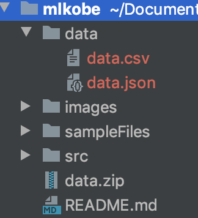

# Kobe Bryant through a Machine Learning Lens


Kobe Bryant is without a doubt one of the greatest basketball players we have ever seen. From hitting some of the most improbable shots, to being the leader of 5 NBA championships, Bryant has inspired millions (myself included). This project allows a user to dive deeper into how Bryant played, specifically how he shot the ball. Users can visualize shots Bryant took over his career or build machine learning models to predict the success of Bryant hitting a shot.  

## Data
The data we will be using for this project is comes from [kaggle](https://www.kaggle.com/c/kobe-bryant-shot-selection). The data has seemingly endless information for every single shot Kobe has ever taken such as: the x,y coordinates the shot was taken, the team Bryant played against, the year the shot was taken, whether the shot was made or not, and even how much time was remaining on the clock when the shot was taken. These are just a few of the many attributes that is provided for every shot Bryant has ever took. Unfortunately, this data is missing 5,000 values (for competition purposes). For the purposes of this project, we will be working with the 25,698 given records. This dataset can be unzipped with the following command in the terminal. 
```bash
unzip data.zip
```

## Setting Up the Directory
Download the "data" folder above to the mlkobe directory. Once the directory looks like this, we can go ahead and get started.



## Visualization Job
Ever wonder what Bryant's shooting record against the lackluster Boston Celtics? Or maybe you want to see how he did in the playoffs against the overhyped Utah Jazz. Maybe you just want to see the 4th quarter shots he has hit against the knock off version of the Lakers: LA Clippers. All this can be done and more by specifying a Visualization Job. Here is an example:

```txt
{"command":"visualize", "specs": ["Opponent:BOS"]}
```
Here, we want to visualize all the shots Kobe has taken against the Boston Celtics. Let's try another example.

```
{"command":"visualize", "specs": ["Opponent:UTA", "ShotType:3PT Field Goal", "Playoffs:1"]}
```
This command gives all the 3-Pointers Kobe took against the Utah Jazz in the playoffs.

In general, to specify a visualization job, simple set "command":"visualize". Further, "specs" is associated with a list of strings. Each element in this list must follow the format above with quotes around the key and value, Uppercase the key, no space between the colon, and the value must match the exact wording found in the dataset. The results of the visualizations can be found in the directory visualizationResults. This directory is automatically made upon running the program.  

## ML Job
NBA analytics and Machine Learning go together like peanut butter and jelly, like Shaq and Kobe, like parallel programming and Go, like UChicago and stress. As mentioned before, we will be working with 25,698 records and several attributes. The all mighty class label is a binary variable that specifies if Bryant Made the shot (1) or if Bryant Missed the shot (0). This project has 4 models to choose from: [Logistic Regression](https://scikit-learn.org/stable/modules/generated/sklearn.linear_model.LogisticRegression.html), [Decision Trees](https://scikit-learn.org/stable/modules/generated/sklearn.tree.DecisionTreeClassifier.html), [Artificial Neural Networks](https://scikit-learn.org/stable/modules/generated/sklearn.neural_network.MLPClassifier.html), and [KNN](https://scikit-learn.org/stable/modules/generated/sklearn.neighbors.KNeighborsClassifier.html).

Here is an example of specifying a ML Job. As you can see, the setup is pretty similar to a visualization job. The difference is the "command" and the "model" part (duhh). Here is an example of a logistic regression model with the paramater C and solver. We want all possible combinations between these two paramaters so that we get a logistic regression model with C = 1 &solver = "newton-cg", C = 2 &solver = "newton-cg", C = 3 &solver = "newton-cg", C = 1 &solver = "lbfgs, C = 2 &solver = "lbfgs", C = 3 &solver = "lbfgs".  

```
{"command":"ml", "model": "logistic regression", "params": ["C", "solver"], "param_range":[[1,3], ["newton-cg", "lbfgs"]]}
```
Here is another example of what the setup for an Articial Neural Network would look like

```
{"command":"ml", "model": "ann", "params": ["hidden_layer_sizes", "activation", "solver"], "param_range":[[3,4], ["tanh", "relu"], ["sgd", "adam"]]}
```
And if you want a less complicated model, behold KNN.
```
{"command":"ml", "model": "knn", "params": ["n_neighbors"], "param_range":[[9,12]]}
```

Each model has several parameters and various ranges that you can specify. As long as the amount of parameters is between 1 and 3 inclusive, you will be able to see how different parameters and parameter ranges perform across models. A quick disclaimer: these models do take some time to run so if you are iterating through C = [1, 9000] for logistic regression, it might be a good idea to find something else to do while the program runs. For each ML job, out of all possible model specifications,the program will automatically return the model with the best accuracy.

## Usage

If you have made it this far in the readme, you're probably tired of me talking and would like to see this project in action. Let's get to it.

We will be using Go and Python to read in a txt file full of jobs (both ml and visualization). This project requires heavy computation so running tasks in parallel will greatly reduce execution time. To get started, make sure you are in the mlkobe directory and run the following command in your terminal.

### Parallel
```bash
go run kobe.go p=8 <sampleFiles/simple.txt
```
p=8 -> Run the program using 8 threads

<sampleFiles/simple.txt -> read from the simple.txt file located in the sampleFiles directory.

Note: this will take some time to run (5ish minutes)


### Sequential
If you wish to run this program sequentially because you love your computer and are kind enough to show some mercy to the CPU, run the following command in your terminal.
```bash
go run kobe.go <sampleFiles/simple.txt
```

## Expected Results
Here are some examples of what the final product of this project can look like!

 

Feel free to improve model results by trying out different model types, with different parameters and different ranges and check out whats possible with the visualizations.

## Acknowledgements
Thanks to Professor Lamont Samuels for teaching a great course on Parallel Programming!

Thanks to Go and Python for making life much easier.

Thanks to Kaggle for the Dataset, StackOverFlow for always being there for me.

And thanks Kobe for the memories! Mamba out but never forgotten.
